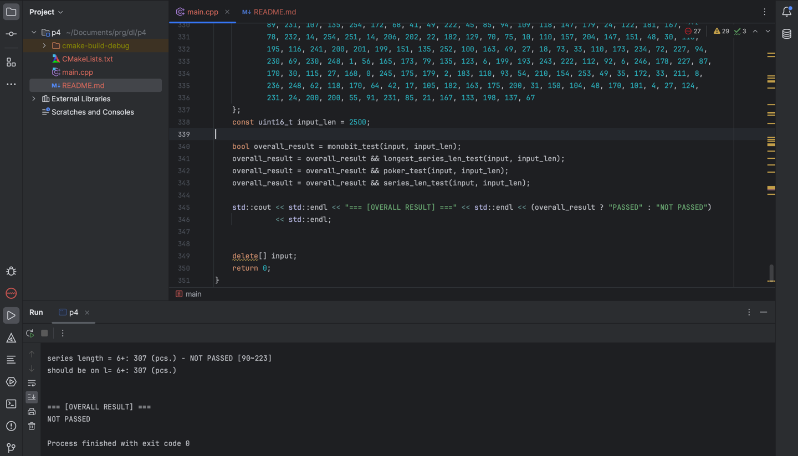

# Task 4
## Building

```sh
cmake -S . -B build
cmake --build build
```

## Example output
```
===[ 1. Monobit test ]===
0 bits     : 9865
(should be): 9865
1 bits     : 10135
(should be): 10135

Test 0 bits: PASSED
Test 1 bits: PASSED

===[ 2. Longest series length test ]===
Longest series length: 14 bits (at byte 695)
(should be)          : 14 bits

Test series length   : PASSED

===[ 3. Poker test ]===
Chi value is: 19.9425
(should be) : 19.9425

Poker test  : PASSED

===[ 4. Series length test ]===
Counters by series length:
series length = 1 : 5058 (pcs.) - NOT PASSED [2267~2733]
should be on l= 1 : 5058 (pcs.)

series length = 2 : 2554 (pcs.) - NOT PASSED [1079~1421]
should be on l= 2 : 2554 (pcs.)

series length = 3 : 1244 (pcs.) - NOT PASSED [502~748]
should be on l= 3 : 1244 (pcs.)

series length = 4 : 574 (pcs.) - NOT PASSED [223~402]
should be on l= 4 : 574 (pcs.)

series length = 5 : 329 (pcs.) - NOT PASSED [90~223]
should be on l= 5 : 329 (pcs.)

series length = 6+: 307 (pcs.) - NOT PASSED [90~223]
should be on l= 6+: 307 (pcs.)


=== [OVERALL RESULT] ===
NOT PASSED
```