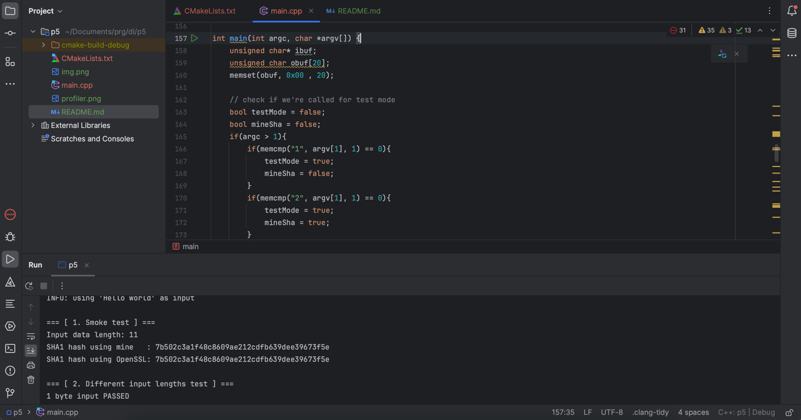
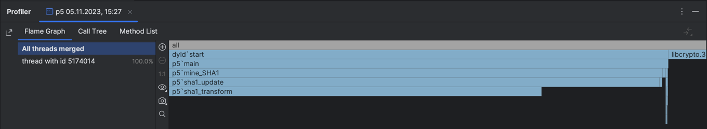

# Task 5
## Building

You may need to adjust `CMakeLists.txt` to correctly link OpenSSL library. 

```sh
cmake -S . -B build
cmake --build build
```

## Usage
The program supports command line arguments:

`p5 <mode=0|1|2> <file>`, where:

* `mode=0` the program runs in demo mode
* `mode=1` means 100k executions of OpenSSL's SHA-1 over given input ('Hello world' of given file contents)
* `mode=2` the same as `1`, but uses own SHA-1 implementation
* When the `file` is given, its content will be used as input instead of standard "Hello world" string

All arguments are optional. When the program runs without arguments, it performs in demo mode (i.e. `mode=0`).

## Speed and memory testing

### Speed testing
The program has built-in speed test. On my machine it gives:
```
100k executions of OpenSSL's SHA-1 took: 56.1811ms
100k executions of mine SHA-1 took: 86.8808ms
```

This means that OpenSSL's SHA-1 implementation is faster. I used system profiler to figure out where is the bottleneck:



Looks like `sha1_transform` which mostly consists of bit manipulation runs too slow. One should consider precomputing, as possible way to improve speed.

### Memory consumption
I used Valgrind Memcheck to measure memory consumption in different modes like this:
```sh
valgrind --tool=memcheck --vgdb=no p5 1
valgrind --tool=memcheck --vgdb=no p5 2
```

> Please note that in 1 and 2 modes, the program does 100k hash function executions

The results are:
* For OpenSSL's implementation – 17,012,761 bytes allocated
* For own implementation – 14,145 bytes allocated

This means that OpenSSL's SHA-1 implementation is less memory effective (in this particular case).

## Example output
```
INFO: using 'Hello world' as input

=== [ 1. Smoke test ] ===
Input data length: 11
SHA1 hash using mine   : 7b502c3a1f48c8609ae212cdfb639dee39673f5e
SHA1 hash using OpenSSL: 7b502c3a1f48c8609ae212cdfb639dee39673f5e

=== [ 2. Different input lengths test ] ===
1 byte input PASSED
64 byte input PASSED
65 byte input PASSED
128 byte input PASSED
129 byte input PASSED

=== [ 3. Speed tests ] ===
100k executions of OpenSSL's SHA-1 took: 46.8943ms
100k executions of mine SHA-1 took: 81.4671ms
```
