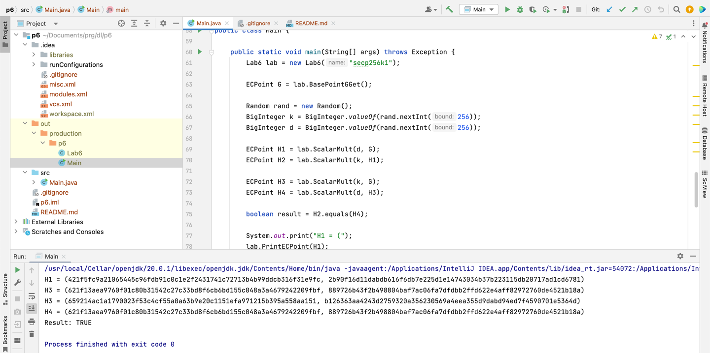

# Task 6
## Building

The easiest way to build the project is to use IntelliJ IDEA.

To run the project w/o the IDE:

* Download "Bouncy Castle Provider" library for your JDK, e.g. [this one](https://mvnrepository.com/artifact/org.bouncycastle/bcprov-jdk18on/1.76)
* Run:

```
cd ./src/
javac -cp ".:./bcprov-jdk18on-1.76.jar" Main.java
java -cp ".:./bcprov-jdk18on-1.76.jar" Main
```

> On Windows please use `;` instead of `:`

## Example output

```
H1 = (f25f6e271e231dfd5f5f8d2aaf30fc6dafe835feca1575e93f667f69d0d97018, bab2192b75324599d2946af2a8737bb68be2ff17f252cebd369ee69a35b4af25)
H3 = (ad379d1fbb9e66a1daa9c0e8b04f1dfb355a3a7ca0ad2ce297c44c04413b7d77, 2473e27f24b99832518a8b95285bde504bdcaff41e7a85234c99bea613484068)
H3 = (1b38903a43f7f114ed4500b4eac7083fdefece1cf29c63528d563446f972c180, 4036edc931a60ae889353f77fd53de4a2708b26b6f5da72ad3394119daf408f9)
H4 = (ad379d1fbb9e66a1daa9c0e8b04f1dfb355a3a7ca0ad2ce297c44c04413b7d77, 2473e27f24b99832518a8b95285bde504bdcaff41e7a85234c99bea613484068)
Result: TRUE
```

## Why Java?

Because Java has the Bouncy Castle library – well known implementation of cryptographic routines. Of course, there are many different options, like OpenSSL. But after some research, I concluded that it is easier to switch to Java with BouncyCastle than trying to deal with tons of deprecated `EC_` functions and challenging documentation.

All in all, I've found at least two good alternatives to BouncyCastle:
* [OpenSSL](https://www.openssl.org)
* [Libecc](https://github.com/libecc/libecc) – looks very good, but I had problems while linking its libraries to my project. Written in C.
