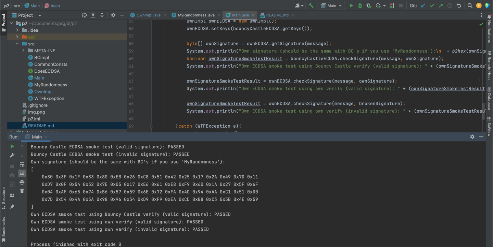

# Task 7
## Building

The easiest way to build the project is to use IntelliJ IDEA.

To run the project w/o the IDE:

* Download "Bouncy Castle Provider" library for your JDK, e.g. [this one](https://mvnrepository.com/artifact/org.bouncycastle/bcprov-jdk18on/1.76)
* Run:

```
cd ./src/
javac -cp ".:./bcprov-jdk18on-1.76.jar" Main.java
java -cp ".:./bcprov-jdk18on-1.76.jar" Main
```

> On Windows please use `;` instead of `:`

## Example output

```
Message:
[ 
	0x48 0x65 0x6C 0x6C 0x6F 0x2C 0x20 0x77 0x6F 0x72 0x6C 0x64 
]
BC signature:
[ 
	0x30 0x3F 0x1F 0x33 0x80 0xEB 0x26 0xC8 0x51 0x42 0x25 0x17 0x2A 0x49 0x7D 0x11 
	0xD7 0x0F 0x54 0x32 0x7E 0x05 0x17 0xE6 0x61 0xE8 0xF9 0x60 0x1A 0x27 0x5F 0x6F 
	0x09 0x6F 0xFA 0x2B 0x1F 0x4B 0x70 0x15 0x6D 0x77 0xA2 0xA7 0x7E 0x24 0x0D 0x73 
	0x53 0x8E 0x83 0xF0 0x09 0x7B 0x8E 0x00 0xB3 0x4D 0x4A 0x6C 0xB4 0x39 0x14 0xBC 
]
Bouncy Castle ECDSA smoke test (valid signature): PASSED
Bouncy Castle ECDSA smoke test (invalid signature): PASSED
Own signature (should be the same with BC's if you use 'MyRandomness'):
[ 
	0x30 0x3F 0x1F 0x33 0x80 0xEB 0x26 0xC8 0x51 0x42 0x25 0x17 0x2A 0x49 0x7D 0x11 
	0xD7 0x0F 0x54 0x32 0x7E 0x05 0x17 0xE6 0x61 0xE8 0xF9 0x60 0x1A 0x27 0x5F 0x6F 
	0x09 0x6F 0xFA 0x2B 0x1F 0x4B 0x70 0x15 0x6D 0x77 0xA2 0xA7 0x7E 0x24 0x0D 0x73 
	0x53 0x8E 0x83 0xF0 0x09 0x7B 0x8E 0x00 0xB3 0x4D 0x4A 0x6C 0xB4 0x39 0x14 0xBC 
]
Own ECDSA smoke test using Bouncy Castle verify (valid signature): PASSED
Own ECDSA smoke test using own verify (valid signature): PASSED
Own ECDSA smoke test using own verify (invalid signature): PASSED
```

## Usage

You may run the program without any command line arguments, so it will:
* Use "Hello, world" as message plaintext
* Use deterministic ECDSA implementation, which means that all random values are pre-defined. Please see `MyRandomness` class for more details.

The application does:
* SHA-256 hashing of plaintext message
* ECDSA signature using Bouncy Castle's implementation
* ECDSA signature verification using Bouncy Castle's implementation
* ECDSA signature using own implementation
* ECDSA signature verification using own implementation
* ECDSA signature verification of the own signature using Bouncy Castle's implementation

As we use fake source of randomness, binary values of signatures should be (and they are indeed) equal between BC's and own ECDSA implementations.

The program accepts two command line arguments:

1. Plaintext message to sign
2. "1" to use fake randomness source or any other value to use true randomness. In this case signatures will differ, but verification still works.

Example:

``
java -cp ".:./bcprov-jdk18on-1.76.jar" Main "Message to sign" 0
``

## Why Java?

Read [here](https://github.com/SerhiiKarazinUni/dlab-crypto/blob/main/p6/README.md#why-java).