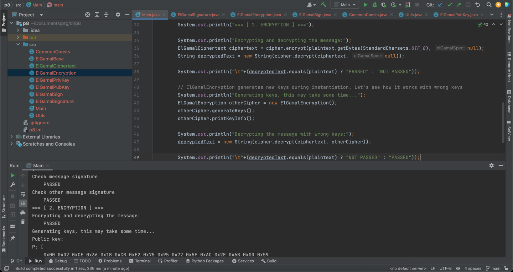

# Task 8
## Building

The easiest way to build the project is to use IntelliJ IDEA.

To run the project w/o the IDE:

* Download "Bouncy Castle Provider" library for your JDK, e.g. [this one](https://mvnrepository.com/artifact/org.bouncycastle/bcprov-jdk18on/1.76)
* Run:

```
cd ./src/
javac -cp ".:./bcprov-jdk18on-1.76.jar" Main.java
java -cp ".:./bcprov-jdk18on-1.76.jar" Main
```

> On Windows please use `;` instead of `:`

## Example output

```
/usr/local/Cellar/openjdk/20.0.1/libexec/openjdk.jdk/Contents/Home/bin/java -javaagent:/Applications/IntelliJ IDEA.app/Contents/lib/idea_rt.jar=64227:/Applications/IntelliJ IDEA.app/Contents/bin -Dfile.encoding=UTF-8 -Dsun.stdout.encoding=UTF-8 -Dsun.stderr.encoding=UTF-8 -classpath /Users/serhiililikovych/Documents/prg/dl/p8/out/production/p8:/Users/serhiililikovych/.m2/repository/org/bouncycastle/bcprov-debug-jdk18on/1.71/bcprov-debug-jdk18on-1.71.jar Main
Generating keys, this may take some time...
Public key:
P: [ 
	0x00 0xD2 0xCE 0x36 0x1B 0xCB 0xE2 0x75 0x95 0x72 0x5F 0xAC 0x2E 0x6B 0x0D 0x59 
	0x48 0xBE 0x50 0x94 0x92 0xCE 0x93 0x29 0x54 0xE8 0xFA 0x6E 0xD4 0xF6 0xC9 0xA9 
	0x17 0x72 0xA7 0xB7 0xAE 0x6B 0x4D 0x3F 0x08 0x93 0xBA 0x26 0x63 0xCA 0x47 0x5B 
	0xDE 0xEA 0xD1 0x3A 0xCC 0xF8 0xA7 0xC3 0x24 0x15 0x14 0x13 0xD7 0x56 0x04 0x34 
	0xEA 0xC9 0x49 0xEE 0xCB 0xE6 0x93 0x55 0x4C 0xBB 0x65 0xEB 0xA1 0x0C 0x98 0x09 
	0x61 0x8F 0x06 0x3C 0x4C 0xD6 0xAB 0xE4 0x94 0xC3 0x27 0x8C 0xD4 0xF1 0x1F 0xCA 
	0x69 0x38 0x90 0xDC 0x12 0x6B 0x2F 0x2D 0x86 0x20 0x3D 0x6B 0x45 0x58 0xE4 0xE9 
	0xFE 0x87 0xC6 0x67 0x5E 0xA7 0x8E 0x0A 0xAE 0x16 0x84 0x6F 0x83 0x0A 0xC3 0x60 
	0x05 0x2D 0xBD 0x97 0x5B 0x5E 0xC1 0xFA 0xF4 0x80 0xDA 0xB8 0x93 0xAE 0x22 0xFD 
	0x9C 0xF4 0xF4 0x85 0xB7 0x9D 0x7F 0xB3 0x14 0xEA 0x16 0x44 0x81 0x30 0x26 0xC6 
	0x8D 0xC2 0xC7 0x80 0xA6 0x95 0xE7 0x62 0x49 0x6C 0x6E 0x59 0x81 0x26 0x3A 0xF7 
	0xED 0x4F 0x7C 0xB2 0x8C 0x4E 0x74 0xC7 0x7B 0x96 0x97 0x94 0xA0 0xE2 0xBE 0x39 
	0xAF 0x40 0x40 0x7E 0xC9 0x77 0xF0 0x2D 0xE1 0x6C 0xD1 0x3D 0xFF 0x8D 0x7A 0xD9 
	0xE6 0x7A 0x30 0xFB 0x59 0x28 0xCA 0x53 0x96 0xCC 0x48 0x9A 0x91 0x50 0xAA 0x3F 
	0x4C 0x5C 0xEB 0x30 0x64 0x1A 0xA1 0xA9 0x92 0x3B 0x11 0x61 0x83 0xE1 0x77 0xE0 
	0x64 0x50 0x12 0xEE 0xD2 0x05 0x5E 0x56 0x83 0x6F 0xE4 0xCA 0x25 0xB9 0x85 0x98 
	0xF3 
]
G: [ 
	0x00 0xBD 0x48 0x28 0xCF 0xD1 0x41 0x6A 0xAB 0xE1 0xE1 0x77 0x35 0xF0 0xA7 0x35 
	0x02 0xA7 0xBD 0x20 0xB0 0xA1 0xB4 0x04 0xE9 0x94 0x3F 0x22 0xD3 0x29 0x42 0xA6 
	0x65 0x84 0xFE 0xFC 0x2B 0x8D 0x58 0x3D 0x7B 0x35 0x31 0x7A 0x9D 0x3D 0xD2 0xA3 
	0x37 0x5B 0x9E 0x73 0x38 0x6A 0x4D 0x9F 0x7E 0xB9 0x33 0xFE 0x5E 0x59 0xA1 0xAF 
	0x97 0x3E 0xA1 0x8A 0x82 0x4E 0x44 0x00 0xD8 0x3E 0x9B 0x51 0xCE 0xC6 0x1A 0xB9 
	0x47 0xCF 0xCF 0x5A 0x73 0x82 0xEC 0xA5 0x0D 0xC1 0x19 0xF1 0xF4 0x41 0x76 0x0A 
	0xC3 0x34 0x2A 0x13 0x68 0x41 0xAD 0x36 0x1F 0x79 0xB0 0x38 0x5A 0x72 0x82 0x25 
	0xFB 0x3B 0xB8 0x2A 0xEA 0x09 0x7B 0x87 0x6A 0x20 0x94 0x74 0x25 0xE8 0x95 0x98 
	0x7D 0x1A 0xD7 0x7F 0xA5 0x35 0x70 0x29 0xCA 0x06 0x2A 0xC7 0xF6 0xA6 0x73 0x07 
	0x2A 0x11 0x0D 0x55 0x14 0x7D 0x8B 0x8A 0x1A 0x8D 0x9D 0xA9 0x5B 0x8E 0x1F 0xFF 
	0x64 0xBA 0xA1 0xC2 0xC6 0x01 0x0A 0x2E 0xB4 0xF9 0x45 0xE6 0x00 0x0B 0xB9 0x8C 
	0xAF 0x3F 0x90 0xB2 0x5B 0x64 0x80 0xCD 0xA6 0x55 0xDC 0x1B 0x3F 0xE6 0x72 0xE0 
	0xF5 0xD1 0x95 0x5A 0x07 0xE1 0xF4 0x2C 0x3C 0x3A 0xB4 0xFD 0x35 0x34 0xEE 0x79 
	0xA8 0xA2 0x63 0xA5 0xD4 0x7A 0x4C 0xDA 0x9D 0x87 0xD8 0xF7 0x78 0x0E 0x1D 0xE3 
	0x59 0x78 0xAA 0xD8 0xAA 0xF2 0xE9 0x55 0xDB 0x6F 0x76 0x97 0x32 0x47 0x90 0x93 
	0x74 0x7F 0x39 0x4B 0xF9 0x7B 0x1F 0x32 0x65 0x8C 0x99 0xD1 0x35 0x74 0xC8 0xCA 
	0x1C 
]
Y: [ 
	0x00 0xB6 0x06 0x61 0xA6 0x64 0x33 0x8E 0x03 0x1F 0x35 0x4C 0x74 0xE1 0xF6 0xC0 
	0xC5 0x80 0x3C 0x82 0x34 0x12 0x8B 0xCB 0x97 0xA6 0xD5 0xC8 0xC6 0x67 0x97 0x06 
	0xBB 0xEF 0x80 0x56 0x8E 0x58 0xFD 0x0F 0xBF 0x8F 0x8A 0x25 0x45 0x3A 0x0D 0x03 
	0x5A 0x36 0x93 0x85 0xBC 0x99 0x30 0xB6 0x62 0x0B 0x26 0xC7 0x4E 0x53 0x6D 0x8A 
	0xBE 0x32 0xBE 0x37 0xEA 0xFD 0xE1 0x64 0xAC 0xA9 0x30 0xCD 0xE9 0xF6 0x36 0x61 
	0x5E 0x9D 0xB8 0x52 0x13 0xFB 0x23 0x69 0x08 0x49 0x3E 0x16 0x34 0x8F 0xF5 0x97 
	0x5F 0x83 0x61 0x99 0x73 0xBB 0x5E 0x84 0x57 0x76 0xA2 0xDD 0xA0 0x03 0x73 0x30 
	0x51 0xAA 0xB0 0xA9 0x63 0xDF 0xAA 0x19 0xD5 0xDC 0x08 0xCD 0x7A 0x44 0xC4 0x1E 
	0x8C 0x8D 0xC4 0xAD 0x65 0x99 0xB3 0xC8 0xBB 0x85 0x6C 0xBF 0xBE 0x07 0xE2 0x37 
	0x3D 0x53 0x80 0x36 0x86 0x9E 0xD5 0xA9 0x7D 0x9D 0x3C 0xFF 0xCE 0xB0 0x14 0x13 
	0x1C 0x67 0xC8 0x8B 0x34 0x1D 0x21 0xE8 0xD2 0xED 0x66 0x1A 0xF4 0xF7 0xBC 0x53 
	0x64 0x03 0x9D 0x86 0xD2 0x81 0x68 0x3C 0x59 0x68 0x68 0x63 0x26 0xE5 0x12 0x87 
	0xC7 0x4F 0x94 0xFE 0x28 0xC7 0x0C 0xA8 0x9B 0x83 0xFE 0x83 0x09 0xDD 0xAA 0xD9 
	0x90 0x28 0x47 0x1C 0x6F 0x96 0x1E 0xF7 0x56 0x60 0x10 0x92 0xBC 0x4E 0x52 0x3C 
	0x19 0x95 0x92 0xBC 0x84 0x62 0x07 0x11 0x98 0x47 0xA3 0x2A 0x3E 0x67 0x53 0xFC 
	0x7F 0x85 0x9F 0xB9 0x59 0xD4 0x0F 0x29 0x3F 0x44 0x64 0x8E 0x70 0xBE 0x22 0x95 
	0x02 
]
Private key:
X: [ 
	0x61 0xA4 0xD2 0xB5 0x04 0xEF 0x60 0x1E 0x0B 0x41 0xEF 0xB9 0x18 0x12 0xC1 0x3D 
	0x7E 0x2B 0x69 0xA7 0x97 0x26 0x73 0x5B 0xD6 0x4A 0xA5 0x8C 0x58 0x37 0x70 0x91 
	0x96 0xF0 0xB7 0xC1 0x39 0x55 0xDC 0xAF 0x6F 0x96 0xC5 0x42 0x5C 0x0A 0x70 0x97 
	0x9F 0x44 0x56 0xB3 0xE8 0xF9 0x10 0x19 0x8C 0xED 0x6C 0x87 0xFE 0x90 0x41 0xD8 
	0xFA 0x77 0x85 0xDF 0x10 0x9F 0x49 0x26 0xB4 0xE3 0x73 0x96 0xD0 0x0F 0xDC 0x36 
	0x25 0x8D 0xBE 0x3D 0x77 0xB8 0xB2 0x05 0xC3 0x23 0x4D 0x3F 0x9A 0xF1 0xE8 0x5B 
	0x8F 0x95 0x35 0x36 0x3B 0xF6 0x72 0x8F 0xFD 0xFC 0xE1 0x35 0xA0 0xF2 0x90 0xB2 
	0x84 0xE4 0xC0 0x3B 0x92 0x7A 0xBF 0xF0 0x0F 0x2D 0x27 0xAC 0x67 0xED 0x40 0xF6 
	0xA9 0x94 0x51 0x97 0x57 0x08 0xD5 0xDE 0xE7 0x6F 0x2C 0xFD 0x5B 0x15 0x78 0x30 
	0xB0 0xB1 0x77 0x26 0x07 0xFF 0x32 0x5C 0x8B 0xBA 0xCC 0x2B 0xB3 0x01 0xF9 0xE4 
	0x4B 0x83 0x9D 0x1C 0x51 0xB1 0xAF 0xA5 0x25 0x77 0x23 0x1F 0x86 0x35 0x2E 0xBC 
	0x9A 0xCF 0x6F 0x03 0x80 0xBC 0xA7 0xEE 0x1E 0xDF 0xCB 0x31 0x3F 0x11 0x9B 0x23 
	0xB3 0x17 0xC2 0x41 0xB3 0x17 0x33 0xBE 0x7F 0xA2 0x41 0xF0 0x85 0xBB 0x2F 0x0B 
	0xDA 0x25 0x4B 0xA9 0xEF 0x0B 0x50 0x75 0x66 0x66 0x17 0x2E 0x32 0xAC 0x2C 0x61 
	0x60 0xA4 0xB9 0xAB 0xF0 0x0C 0x1B 0x96 0x8C 0x7E 0x2E 0x79 0x29 0x3D 0xBC 0x2A 
	0x56 0xAB 0x72 0x10 0x91 0xA9 0xF4 0x01 0x10 0x49 0x22 0x48 0x1E 0x23 0xDF 0xED 
]
=== [ 1. SIGNATURE ] ===
Signature:
R: [ 
	0x57 0xAC 0x93 0xD2 0xE2 0x66 0xC8 0x45 0x0A 0x7E 0x6D 0x15 0x5E 0x92 0xFF 0x15 
	0xC3 0xB3 0xFD 0xFF 0x73 0x18 0x32 0x12 0xE8 0xB5 0x77 0x5B 0xD7 0xB9 0x7E 0x73 
	0x3D 0xAA 0xEE 0x55 0xF0 0xC0 0x2D 0x31 0x0A 0x41 0xB6 0xCB 0xA2 0x50 0xFB 0xEB 
	0x51 0x7E 0x86 0xCF 0x63 0x4D 0xC2 0x6D 0x9D 0x1D 0x30 0x16 0xF0 0x25 0x0B 0xF0 
	0xA6 0x4E 0x14 0xF1 0xB7 0x4E 0xA5 0x8F 0x15 0x7A 0xEC 0x55 0x56 0x61 0xBD 0x3B 
	0x10 0x5B 0x46 0x16 0xA0 0xA0 0xD4 0x48 0xD2 0xB6 0xBF 0x1A 0x3B 0x29 0x11 0xDA 
	0x80 0x44 0x07 0xCE 0xF4 0x8C 0xC6 0x2A 0xF2 0x0A 0x13 0x45 0x6D 0x19 0x93 0x4F 
	0x85 0x76 0xFE 0xF5 0xBF 0xB7 0xC5 0xF9 0x76 0xC2 0xD5 0xCD 0x97 0x32 0x40 0x37 
	0xEE 0x62 0x11 0xA5 0x62 0x1B 0xF7 0xC8 0x36 0x34 0x7E 0xD5 0xC6 0x81 0xCD 0x71 
	0x22 0x1C 0xE1 0x8E 0xD2 0x8A 0xF3 0x69 0x9E 0x4D 0x9F 0xBC 0x56 0x3E 0xC1 0x9E 
	0xD2 0x8A 0xC0 0x6E 0x76 0xDF 0xFD 0xBB 0xFD 0xA4 0x23 0x80 0xAF 0xAB 0xA6 0x9E 
	0x67 0x55 0x76 0x0A 0xB1 0x0B 0x4D 0x55 0x35 0x70 0xDD 0x06 0x15 0x57 0x8D 0x3A 
	0x86 0xEC 0x0C 0x5E 0x87 0x82 0x5D 0xA8 0x6A 0x28 0xEA 0x8D 0x88 0x00 0x13 0xCA 
	0xF3 0xD9 0xAD 0x09 0xBA 0x2F 0x19 0x4C 0x4F 0xFD 0x43 0x45 0xBA 0xC4 0xE3 0x17 
	0x25 0xA9 0x26 0x93 0xE9 0x8E 0x7B 0x08 0x03 0xF1 0x4A 0xF0 0x69 0x85 0xED 0x8A 
	0xCE 0x91 0xC5 0xB6 0x04 0xD4 0x76 0xAA 0x23 0x08 0x36 0xEB 0x84 0xE4 0x02 0x39 
]
S: [ 
	0x49 0x82 0x7D 0x20 0xB6 0x43 0x08 0x17 0x2E 0x53 0xEC 0x65 0xBC 0x7F 0x2E 0x4D 
	0x16 0x10 0x6F 0xBD 0x31 0x63 0xDA 0xB1 0x23 0x43 0x3A 0x84 0xC3 0x20 0x34 0xEB 
	0x67 0xC2 0x42 0xFC 0xDC 0xB9 0xB4 0xFB 0xCF 0xD3 0x52 0xDC 0xC6 0x47 0x59 0x78 
	0xA7 0x0C 0x73 0x30 0xF9 0xBF 0xC8 0x17 0xC8 0x93 0x27 0x0A 0xDD 0x54 0x61 0x24 
	0xD6 0x65 0x19 0xD5 0x24 0x5F 0xBF 0x38 0x90 0xCA 0x8D 0x87 0xB7 0x1F 0x69 0x50 
	0x11 0x2F 0xE4 0x15 0x7E 0x5A 0xA8 0x5A 0x46 0x56 0x78 0x50 0x5C 0x55 0x9C 0xA9 
	0x1A 0x2D 0x29 0x96 0xD7 0x9A 0x6D 0xFE 0x46 0x3E 0xE4 0x83 0xE7 0xAE 0x00 0xAC 
	0x9E 0xFC 0xA4 0x37 0x94 0x9A 0x48 0xC4 0x1C 0x78 0x8D 0x09 0x6A 0x36 0x64 0x1A 
	0xDA 0x25 0x0D 0x59 0xD3 0x9D 0xB7 0xB2 0x53 0x53 0xA7 0x31 0x46 0xFA 0x6F 0x64 
	0xC6 0x36 0xB3 0xB8 0x0A 0xAC 0x68 0x6B 0xA1 0x12 0x5D 0x70 0xF7 0xB0 0x0F 0x44 
	0x63 0xA5 0xC3 0x74 0xF6 0x68 0x28 0x1E 0x09 0x39 0xD7 0x15 0x44 0x1D 0xD2 0x3F 
	0x90 0xF9 0xA9 0x15 0x99 0x45 0xD2 0x69 0xA9 0xC6 0xAA 0xF1 0x43 0x72 0x6D 0x0C 
	0xB5 0xD2 0x98 0x1A 0xD9 0xE6 0x06 0x2C 0x4E 0xC7 0xFA 0xCF 0x93 0x88 0x16 0x69 
	0x14 0x19 0x3F 0x4A 0x73 0xA2 0x0D 0xBB 0x62 0xB1 0x42 0x47 0x06 0xB9 0x99 0xC5 
	0x2E 0xD8 0xBF 0x76 0xA8 0x86 0xEC 0x48 0x99 0x59 0x9A 0xC1 0x0D 0xF7 0x33 0xF8 
	0x9A 0x2A 0x51 0x37 0x0B 0x43 0x01 0xFC 0x2B 0x21 0xE9 0xB0 0xDD 0x48 0x11 0xCF 
]
Check message signature
	PASSED
Check other message signature
	PASSED
=== [ 2. ENCRYPTION ] ===
Encrypting and decrypting the message:
	PASSED
Generating keys, this may take some time...
Public key:
P: [ 
	0x00 0xD2 0xCE 0x36 0x1B 0xCB 0xE2 0x75 0x95 0x72 0x5F 0xAC 0x2E 0x6B 0x0D 0x59 
	0x48 0xBE 0x50 0x94 0x92 0xCE 0x93 0x29 0x54 0xE8 0xFA 0x6E 0xD4 0xF6 0xC9 0xA9 
	0x17 0x72 0xA7 0xB7 0xAE 0x6B 0x4D 0x3F 0x08 0x93 0xBA 0x26 0x63 0xCA 0x47 0x5B 
	0xDE 0xEA 0xD1 0x3A 0xCC 0xF8 0xA7 0xC3 0x24 0x15 0x14 0x13 0xD7 0x56 0x04 0x34 
	0xEA 0xC9 0x49 0xEE 0xCB 0xE6 0x93 0x55 0x4C 0xBB 0x65 0xEB 0xA1 0x0C 0x98 0x09 
	0x61 0x8F 0x06 0x3C 0x4C 0xD6 0xAB 0xE4 0x94 0xC3 0x27 0x8C 0xD4 0xF1 0x1F 0xCA 
	0x69 0x38 0x90 0xDC 0x12 0x6B 0x2F 0x2D 0x86 0x20 0x3D 0x6B 0x45 0x58 0xE4 0xE9 
	0xFE 0x87 0xC6 0x67 0x5E 0xA7 0x8E 0x0A 0xAE 0x16 0x84 0x6F 0x83 0x0A 0xC3 0x60 
	0x05 0x2D 0xBD 0x97 0x5B 0x5E 0xC1 0xFA 0xF4 0x80 0xDA 0xB8 0x93 0xAE 0x22 0xFD 
	0x9C 0xF4 0xF4 0x85 0xB7 0x9D 0x7F 0xB3 0x14 0xEA 0x16 0x44 0x81 0x30 0x26 0xC6 
	0x8D 0xC2 0xC7 0x80 0xA6 0x95 0xE7 0x62 0x49 0x6C 0x6E 0x59 0x81 0x26 0x3A 0xF7 
	0xED 0x4F 0x7C 0xB2 0x8C 0x4E 0x74 0xC7 0x7B 0x96 0x97 0x94 0xA0 0xE2 0xBE 0x39 
	0xAF 0x40 0x40 0x7E 0xC9 0x77 0xF0 0x2D 0xE1 0x6C 0xD1 0x3D 0xFF 0x8D 0x7A 0xD9 
	0xE6 0x7A 0x30 0xFB 0x59 0x28 0xCA 0x53 0x96 0xCC 0x48 0x9A 0x91 0x50 0xAA 0x3F 
	0x4C 0x5C 0xEB 0x30 0x64 0x1A 0xA1 0xA9 0x92 0x3B 0x11 0x61 0x83 0xE1 0x77 0xE0 
	0x64 0x50 0x12 0xEE 0xD2 0x05 0x5E 0x56 0x83 0x6F 0xE4 0xCA 0x25 0xB9 0x85 0x98 
	0xF3 
]
G: [ 
	0x00 0xBD 0x48 0x28 0xCF 0xD1 0x41 0x6A 0xAB 0xE1 0xE1 0x77 0x35 0xF0 0xA7 0x35 
	0x02 0xA7 0xBD 0x20 0xB0 0xA1 0xB4 0x04 0xE9 0x94 0x3F 0x22 0xD3 0x29 0x42 0xA6 
	0x65 0x84 0xFE 0xFC 0x2B 0x8D 0x58 0x3D 0x7B 0x35 0x31 0x7A 0x9D 0x3D 0xD2 0xA3 
	0x37 0x5B 0x9E 0x73 0x38 0x6A 0x4D 0x9F 0x7E 0xB9 0x33 0xFE 0x5E 0x59 0xA1 0xAF 
	0x97 0x3E 0xA1 0x8A 0x82 0x4E 0x44 0x00 0xD8 0x3E 0x9B 0x51 0xCE 0xC6 0x1A 0xB9 
	0x47 0xCF 0xCF 0x5A 0x73 0x82 0xEC 0xA5 0x0D 0xC1 0x19 0xF1 0xF4 0x41 0x76 0x0A 
	0xC3 0x34 0x2A 0x13 0x68 0x41 0xAD 0x36 0x1F 0x79 0xB0 0x38 0x5A 0x72 0x82 0x25 
	0xFB 0x3B 0xB8 0x2A 0xEA 0x09 0x7B 0x87 0x6A 0x20 0x94 0x74 0x25 0xE8 0x95 0x98 
	0x7D 0x1A 0xD7 0x7F 0xA5 0x35 0x70 0x29 0xCA 0x06 0x2A 0xC7 0xF6 0xA6 0x73 0x07 
	0x2A 0x11 0x0D 0x55 0x14 0x7D 0x8B 0x8A 0x1A 0x8D 0x9D 0xA9 0x5B 0x8E 0x1F 0xFF 
	0x64 0xBA 0xA1 0xC2 0xC6 0x01 0x0A 0x2E 0xB4 0xF9 0x45 0xE6 0x00 0x0B 0xB9 0x8C 
	0xAF 0x3F 0x90 0xB2 0x5B 0x64 0x80 0xCD 0xA6 0x55 0xDC 0x1B 0x3F 0xE6 0x72 0xE0 
	0xF5 0xD1 0x95 0x5A 0x07 0xE1 0xF4 0x2C 0x3C 0x3A 0xB4 0xFD 0x35 0x34 0xEE 0x79 
	0xA8 0xA2 0x63 0xA5 0xD4 0x7A 0x4C 0xDA 0x9D 0x87 0xD8 0xF7 0x78 0x0E 0x1D 0xE3 
	0x59 0x78 0xAA 0xD8 0xAA 0xF2 0xE9 0x55 0xDB 0x6F 0x76 0x97 0x32 0x47 0x90 0x93 
	0x74 0x7F 0x39 0x4B 0xF9 0x7B 0x1F 0x32 0x65 0x8C 0x99 0xD1 0x35 0x74 0xC8 0xCA 
	0x1C 
]
Y: [ 
	0x00 0xA9 0x03 0x38 0xE2 0x01 0x2A 0x72 0x9B 0x22 0xCB 0xBA 0x0E 0xDB 0xD4 0x3D 
	0xE2 0x4A 0xFE 0x16 0x52 0xAF 0x0F 0xAF 0xAE 0xE6 0xB5 0xAE 0x5D 0xA8 0xEE 0x76 
	0xF9 0x19 0xD1 0x83 0xC7 0xFB 0x09 0x90 0xD5 0x33 0xB7 0xCC 0x2E 0x00 0xE4 0x8C 
	0x7F 0x59 0xD7 0x54 0xFB 0x9F 0x10 0x2E 0x0E 0x5B 0x82 0xCE 0xF3 0xFA 0xF1 0xD3 
	0x33 0xC8 0x93 0x6A 0x94 0x44 0x1D 0x84 0xBC 0xD6 0x0F 0xA1 0xE9 0xAA 0x76 0x9C 
	0x70 0xB0 0xF6 0x14 0x5D 0x38 0x72 0x45 0x32 0xE8 0xBF 0x40 0xC9 0xB5 0x1A 0x94 
	0x66 0x9B 0x5B 0xC0 0x7F 0x99 0x9E 0x5A 0xFE 0x67 0xBF 0xC8 0x4C 0xAE 0x56 0x8C 
	0x64 0x66 0xB3 0xA1 0xD2 0xA8 0xAC 0xE8 0x7C 0x35 0xBB 0xCE 0x80 0x63 0x2C 0xE4 
	0x1D 0x15 0xB9 0x55 0xC7 0x22 0x0B 0x77 0xF2 0x9B 0x88 0xCC 0x01 0x73 0x88 0x90 
	0x4C 0xE6 0xAB 0xCA 0xE3 0xE9 0x14 0x53 0x5D 0xFD 0x7B 0xAC 0xC4 0x70 0xDD 0x5E 
	0xEB 0x04 0x8F 0xCF 0xDB 0x0F 0xE0 0x72 0x5F 0xAE 0x3A 0xD4 0x2A 0x49 0x1B 0xEB 
	0x70 0x57 0x78 0x8A 0x99 0x54 0x32 0x82 0xB6 0x89 0x81 0x7B 0x36 0xE8 0x61 0x00 
	0x14 0xA0 0x03 0x02 0xEF 0xE4 0x61 0xC3 0x0F 0xBF 0x24 0xF9 0x05 0x63 0x70 0x4B 
	0xB2 0x47 0x5A 0x65 0x3B 0x3B 0x2B 0xF5 0x16 0xD8 0xA5 0xEA 0x4C 0x04 0x6E 0xB2 
	0xF3 0x43 0x23 0xDB 0xCE 0x1F 0xCC 0xB5 0x34 0x48 0xCC 0x53 0x4D 0x3D 0xFD 0x5D 
	0x83 0xD1 0xB7 0xD7 0x94 0xA2 0xF7 0x43 0xA9 0x9D 0x85 0x05 0x7C 0x5A 0x59 0x56 
	0xAB 
]
Private key:
X: [ 
	0x19 0x5D 0xCA 0x14 0xC8 0x64 0x1B 0xFC 0x2D 0x1F 0x47 0x76 0x85 0x84 0xA2 0x5D 
	0xF1 0xB8 0x95 0x53 0xE1 0xB6 0xB2 0xC5 0x3E 0x8A 0x58 0x82 0xA7 0xB9 0xFE 0xA9 
	0x18 0xD2 0x5B 0x4C 0xBC 0xE4 0x7B 0x99 0x47 0x2C 0x4E 0x81 0x12 0x30 0xA1 0x54 
	0x43 0xD4 0xE8 0x65 0x53 0x38 0x64 0xFB 0x4A 0x94 0xCB 0x80 0xDA 0xDC 0x93 0xC3 
	0xED 0x73 0x25 0xF8 0x8D 0x10 0x23 0x56 0x8D 0x2C 0x81 0x7E 0x40 0x7A 0xEE 0xA8 
	0x42 0x40 0x48 0x1C 0x0F 0x2D 0x44 0x21 0x9F 0x43 0xB6 0x9E 0xAA 0x05 0xBF 0xB2 
	0x9E 0xD7 0x4A 0x8C 0x23 0xF7 0x81 0xA8 0xEC 0x67 0x19 0x2F 0x8D 0x0F 0x0C 0xDE 
	0xC9 0x39 0x01 0x6B 0x07 0xCE 0x79 0x69 0x78 0x51 0x54 0xA9 0x3A 0x8C 0xF0 0x16 
	0x12 0xD5 0x86 0x90 0x2A 0x4E 0x4D 0x98 0x4F 0x1C 0xC4 0x79 0x05 0x35 0x63 0xC4 
	0x2D 0x2D 0x3E 0xB2 0x67 0x36 0x58 0x9B 0x59 0x6F 0xD4 0xEF 0x61 0xF5 0x4D 0xA5 
	0x59 0xAA 0xF9 0xBB 0xCC 0x08 0x7B 0x0E 0x52 0xDE 0xAD 0x76 0x31 0x0B 0x9A 0xAE 
	0x64 0x65 0xE8 0x92 0x01 0x49 0xA7 0x28 0x91 0x00 0x91 0xA3 0x35 0x3F 0xE4 0x71 
	0x35 0x67 0xFA 0x75 0xE9 0x11 0x5D 0xB1 0x7B 0xEF 0xD5 0xD7 0xD2 0x95 0x2B 0x4C 
	0xE0 0x50 0xD2 0xAC 0xEE 0x24 0xA0 0x35 0x25 0x06 0x8B 0x87 0xBB 0xA9 0xCC 0x6F 
	0xD7 0xE6 0x79 0xA4 0x27 0x82 0x62 0xAE 0x5C 0x47 0xD4 0x76 0x48 0x6A 0x51 0x9B 
	0x85 0x3D 0xE6 0xAA 0xBE 0xF2 0x75 0x81 0x70 0x76 0x67 0x46 0xDB 0xA6 0x4B 0x45 
]
Decrypting the message with wrong keys:
	PASSED
```

## Usage

The program does not require any command line arguments. What it does:
* Generates keys
* Computes message signature using ElGamal algorithm
* Checks the signature against valid and changed plaintext
* Encrypts/decrypts the message using ElGamal algorithm
* Tries to decrypt the ciphertext using invalid keys

> One can check `ElGamalBase` class, where it is possible to change the method how the keys will be generated. By default, the program uses pre-calculated P and G numbers in order to work faster. There are two additional sources of Ps and Gs available. 

``
java -cp ".:./bcprov-jdk18on-1.76.jar" Main
``

## Why Java?

Read [here](https://github.com/SerhiiKarazinUni/dlab-crypto/blob/main/p6/README.md#why-java).